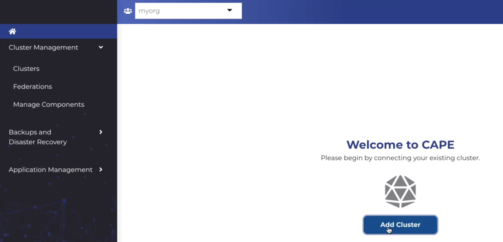

Let's continue from Install Cape tutorial. To create Federation, you need to add another cluster

1. Click <b>'Cluster'</b>. The Clusters page with existing clusters are displayed.
2. Click <b>'Add Clusters'</b>.

3. Select and click <b>'Private K8s'</b>, and click <b>'Next'</b>

4. Enter information as per below screenshot, and click <b>'Connect'</b>
[K8s](./assets/Nameyourclusterandconfigfile.png)
5. You will see 'Waiting for agent connection' message. Copy the Kubectl command line.

6. Go back to katacoda terminal, and paste the Kubectl command line.

7. Wait for the command to execute and go back to CAPE Console UI. You will see the following message:

