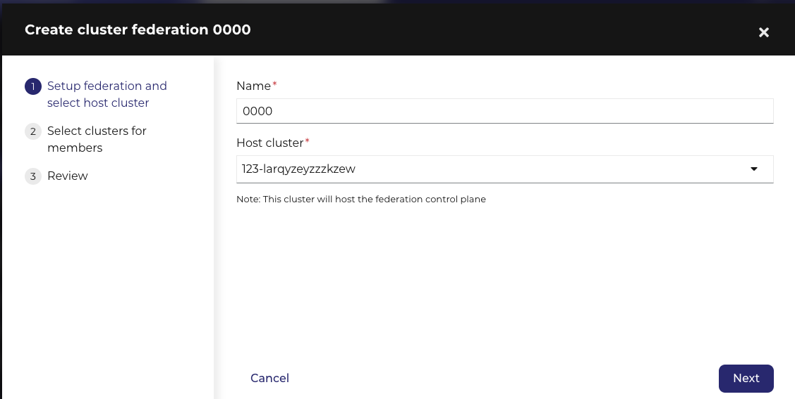

After adding the seccond cluster, you can create a federation.

1. Click 'Federations'
2. Click 'Create federation'

3. Enter a name for the federation and choose the host cluster from the drop-down list, and click 'Next'
4. Select the clusters for this federation and click 'Next'
5. Review the settings and click 'Connect'

