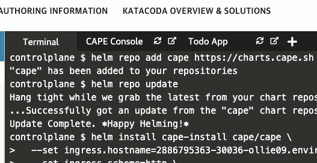

Run the following command to set api base path so that member clusters can reach CAPE control plane and also accept terms of use
```
kubectl -n cape set env deploy/web \
  CAPE_ACCEPT_TOS=true -n cape \
  API_BASE_URL=https://[[HOST_SUBDOMAIN]]-30036-[[KATACODA_HOST]].environments.katacoda.com
```{{execute HOST1}}


Wait for the updated message that CAPE deployment is complete (this process can take up to 5 minutes). 

Click the CAPE console tab to access the CAPE UI as shown:


