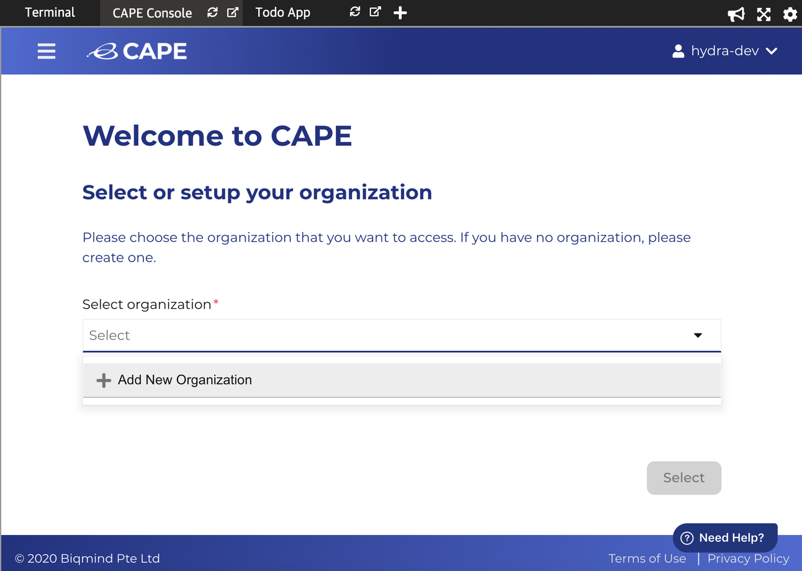

Set up your organization.

1. Add New Organization by selecting from the dropdown menu
    
2. Enter an organization name, for example "myorg".
    <b>Note:</b> Please use lowercase for all CAPE configurations.
    
3. Click <b>'Complete'</b>.
4. Select <b>'myorg'</b> from the dropdown list and click <b>Select</b>. 

