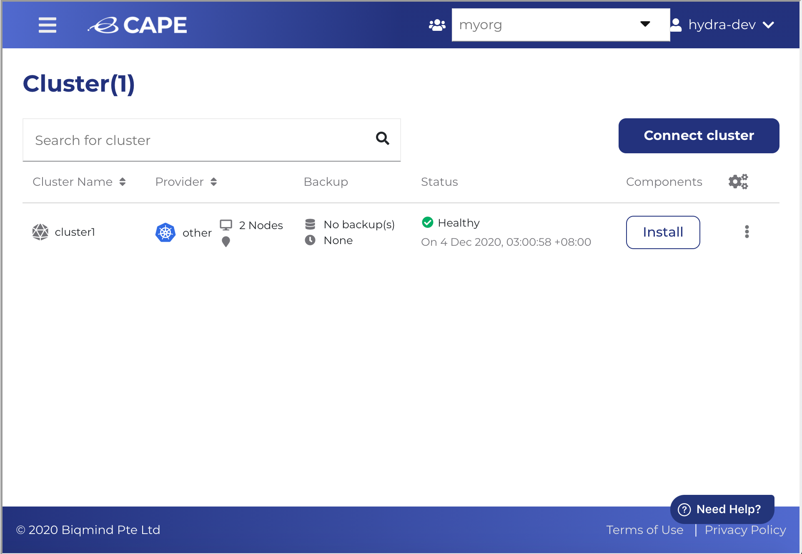

<b>Note:</b> The tutorial will use Kubernetes for connecting to a cluster.

1. Click <b>'Add Cluster'</b>.

2. Select and click <b>'Private K8s'</b>, and click <b>'Next'</b>

3. Enter a cluster name, for example 'cluster1' and select 'Connect cluster using kubectl', and click <b>'Connect'</b>
[K8s](./assets/Nameyourclusterandconfigfile.png)
4. You will see 'Waiting for agent connection' message. Copy the Kubectl command line.

5. Go back to Katacoda terminal, and paste the Kubectl command line.

6. Wait for the command to execute and go back to CAPE Console UI. You will see the following message:

7. Click 'Close' and the Cluster Dashboard is displayed.

