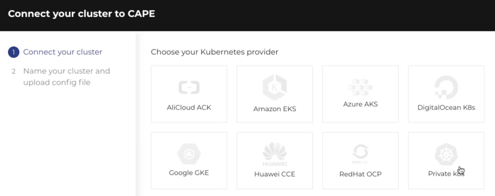

<b>Note:</b> The tutorial will use K8s for connecting to a cluster.

To connect a cluster:
1. Click <b>Cluster Management</b> from the main menu to displayed the sub-menu.
2. Click <b>Cluster</b>. The Clusters page with existing clusters are displayed.
3. Click <b>Add Clusters</b>.

4. Select and click <b>Private K8s</b> and click <b>Next</b>

5. Enter the following information as indicated in the following screenshot and click <b>Connect</b>

6. The waiting for agent connection is displayed. Copy the Kubectl command line.

7. Go back to katacoda terminal, and paste the Kubectl command line.

8. Wait for the command to execute and go back to CAPE UI. A success message is displayed.

