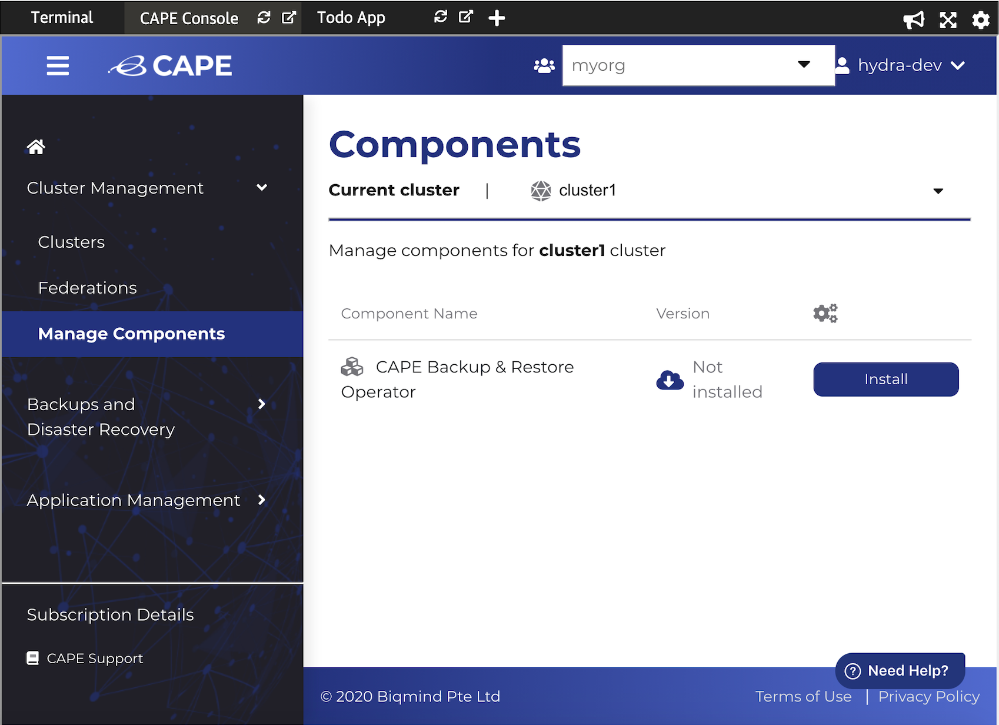
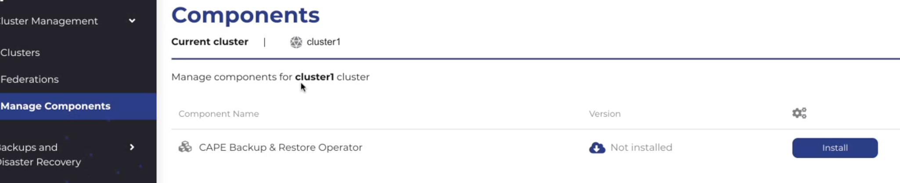
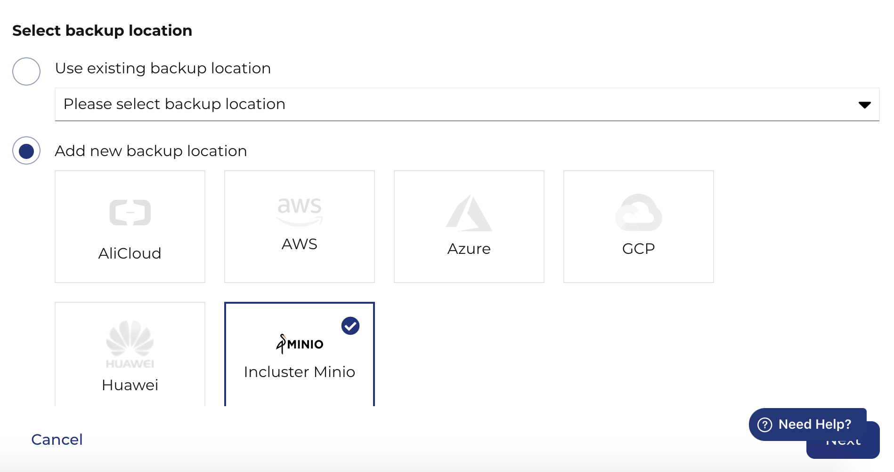
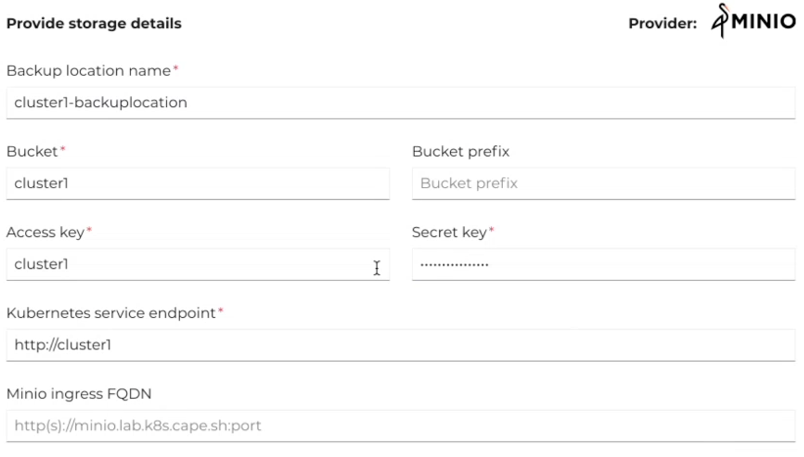
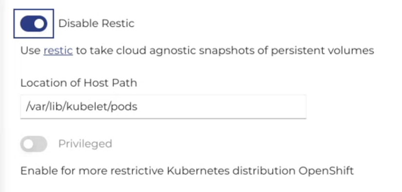
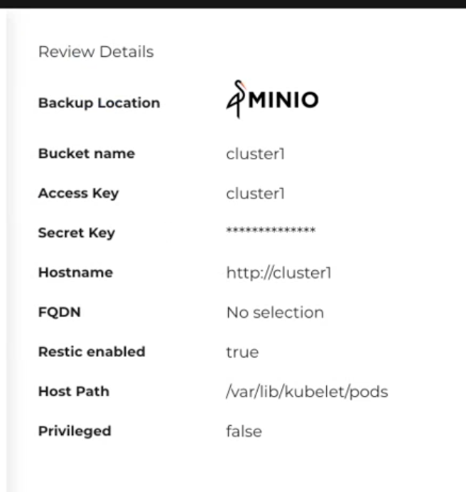
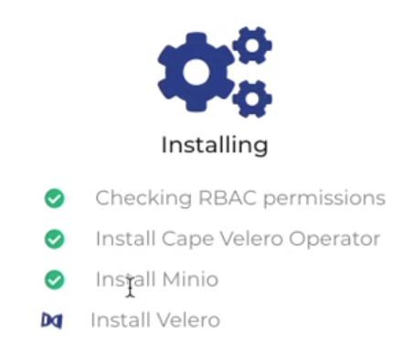

<b>Note:</b>This tutorial will use MinIO as storage.

1. Navigate to CAPE Menu and select <b>'Manage Components'</b> from the sidebar. Avaliable/installed components are displayed.
 
2. Select the component to be installed and click 'Install'
 
3. MinIO is selected by default under Add new backup location option. Click 'Next'
 
4. Enter the following details as displayed below and click <b>'Next'</b> <b>Note:</b> You can enter any value for the secret.
 
5. <b>'Restic'</b> is enabled by default, click <b>'Next'</b>
 
6. Review the component details and click <b>'Install'</b>
 
7. You will see the following installation progress screen.
  
8. Click 'Close' to return to Components Page when installation has completed. 

