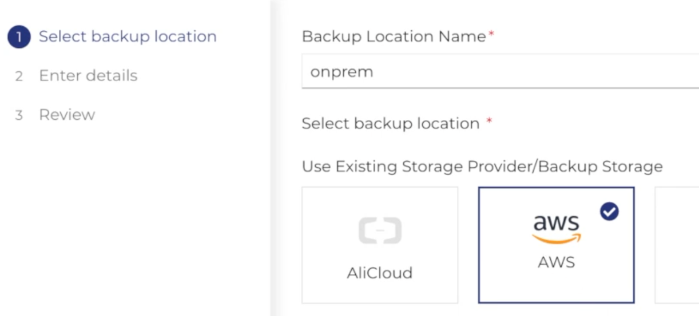
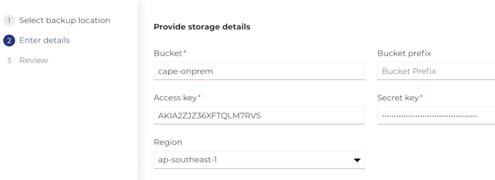
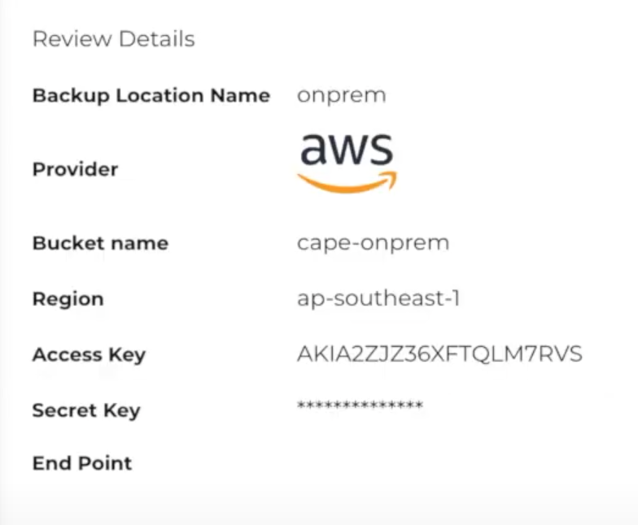
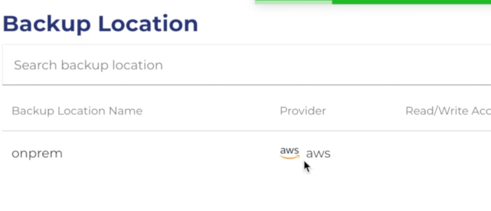

To create a backup location:

1. Click Backup and Disaster Recovery from the main menu to display the sub-menu.
2. Click Backup Location.The Backup Location page with existing backups locations are displayed.
3. Click Add backup location. The wizard is displayed.
4. Enter the backup location details, and click Next.

5. Enter the storage details, and click Next.

6. Review the details, and click Add.

7. After backup storage is added, the details are displayed  

