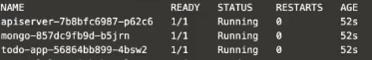

We have prepared an app (to-do-app) to be use for this tutorial. Before using this app, we need to create a namespace 

1. Before using this app, we need to create a namespace. In the terminal, run the following command to create the following namespace 'to-do'.

    ```
    kubectl create namespace todo
    ```{{execute HOST1}}

2. Run the following command to deploy the app to the cluster.

    ```
    kubectl apply -f https://raw.githubusercontent.com/debianmaster/go-to-do-app/master/deploy-stateless/k8s.yaml -n todo
    ```{{execute HOST1}}

3. Run the following command to verify deployment:

    ```
    kubectl -n cape wait --for=condition=available --timeout=600s deployment/todo-app -n todo    
    ```{{execute HOST1}}

4. After the app is deploy, run the following command to check the app namespace

    ```
    kubectl get po -n todo
    ```{{execute HOST1}}

    The following screenshot displayed the status.

    
5. Once the status for the app namespace is running, run the following command to display the app in port 3000.

    ```
    kubectl port-forward svc/todo-app 3000 -n todo --address 0.0.0.0
    ```{{execute HOST1}}

6. Click the Todo App tab to access the app

    

    The following app screenshot is displayed.
    

7. Enter some tasks as shoen in the following screenshot.
    

    Now, you are ready to backup.


