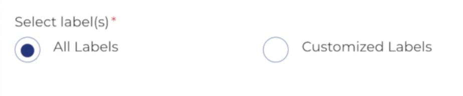
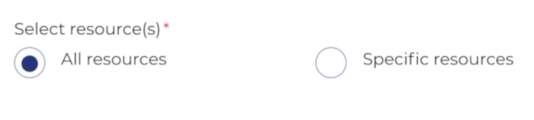
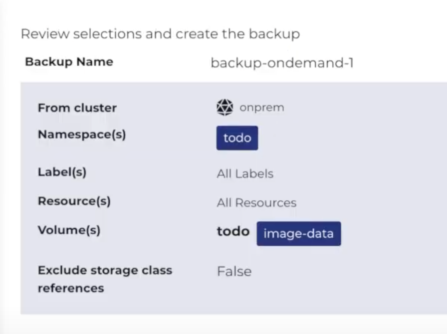

1. Click 'Backup' from the main menu. The Backup page with existing backups are displayed.
2. Select the cluster to create the backup.
3. Click Create backup. The wizard is displayed.
4. Select 'namespace', and click 'Next'.

5. Select label(s), and click 'Next'.

6. Select resource(s), and click 'Next'.

7. Select volume(s), and click 'Next'.

8. Select schedule, and click 'Next'.

9. Review the details, and click 'Create'

10. After backup is created, the details are displayed  

Note: Backup will take some time depending on your data.

