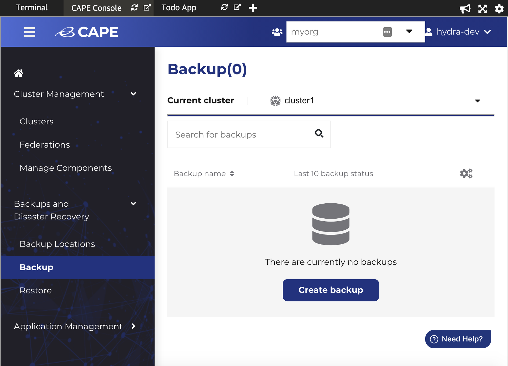
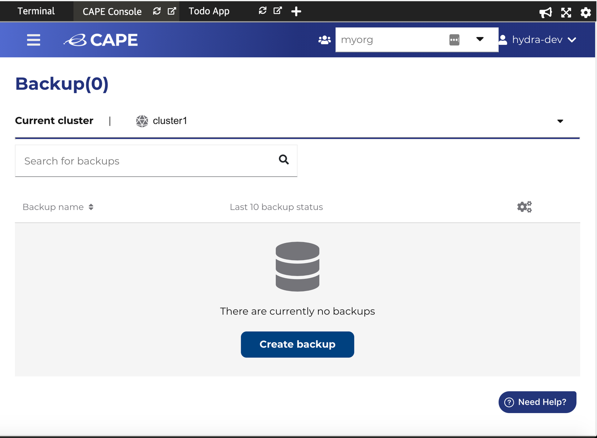
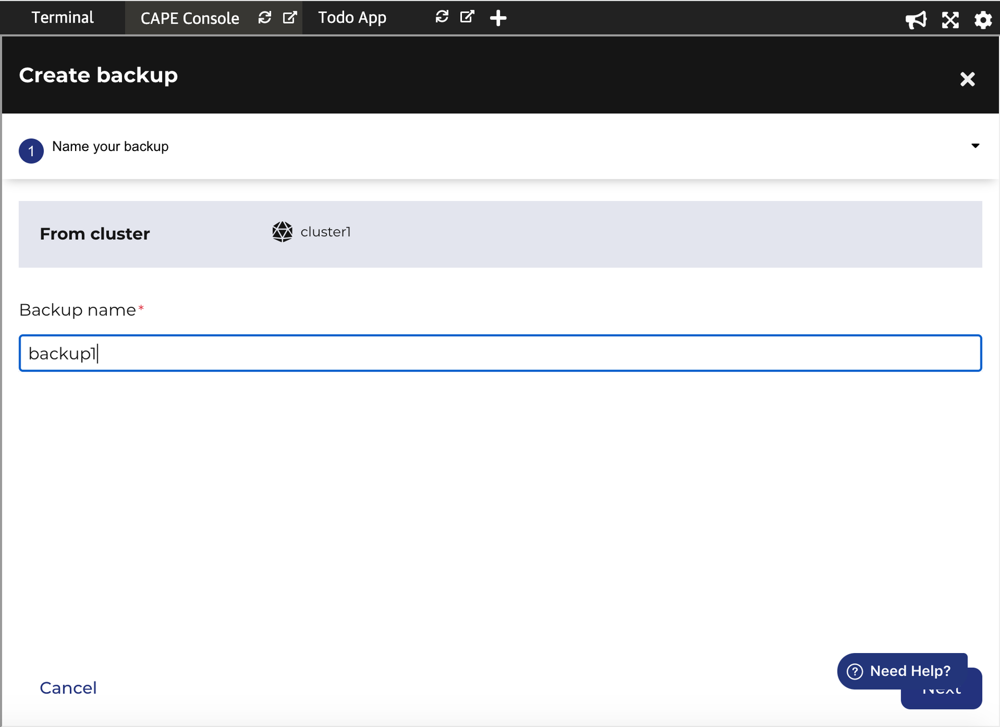
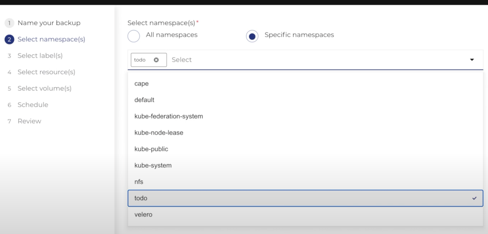
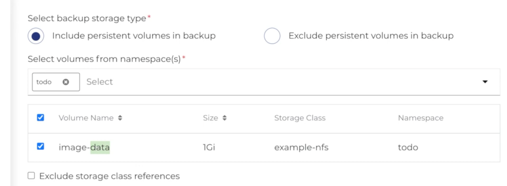
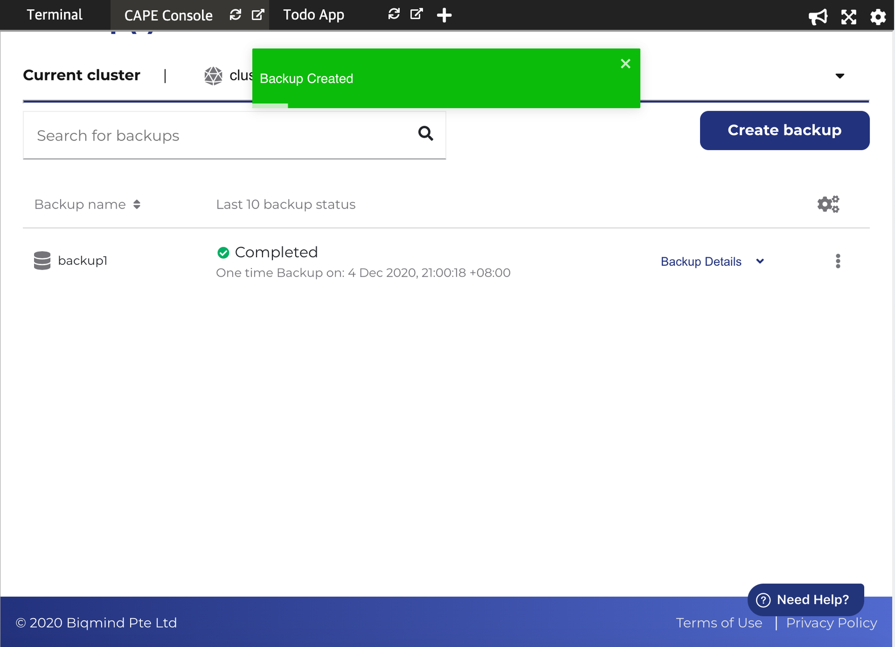

1. On 'CAPE Console', navigate to 'CAPE menu', then 'Backups and Disaster Recovery' and select 'Backup'.

2. 'cluster1'. is selected by default. Click 'Create backup'

3. Enter backup name, for example 'backup1' and click 'Next'.

4. Select 'todo' from the Specific namespace dropdown menu..

5. 'All Labels' is selected by default. Click 'Next'
6. 'All resources' is selected by default. Click 'Next'.
7. The option 'Include persistent volumes in backup' is selected  by default.

8. One time (now) backup schedule option is selected by default. Click 'Next'.

9. Review selections and click 'Create' to create the backup.
10. After backup is created, the details are displayed  

Note: Backup will take some time depending on your data.

