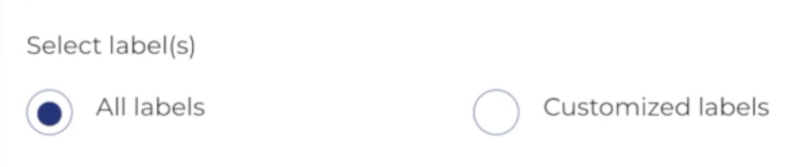

To restore a backup:

1. Click 'Restore' from the main menu. The Restore page with existing restores are displayed.
2. Select the cluster to restore the backup.
3. Click 'Restore backup'. The wizard is displayed.
4. Name your restore and select backup(created in previous step 8), and click 'Next'.

5. Select namespace, and click 'Next'.

6. Select label(s), and click 'Next'.

7. Select resource(s), and click 'Next'.

8. Select resource mapping, and click 'Skip'.

9. Select volume(s), and click 'Next'.

10. Review the details, and click 'Restore'

11. A Confirm Restore pop-up is displayed. Enter 'I agree', and click 'Confirm' to restore.

12. After backup is restore, the details will be displayed:  

Note: Restore will take some time depending on your data.

